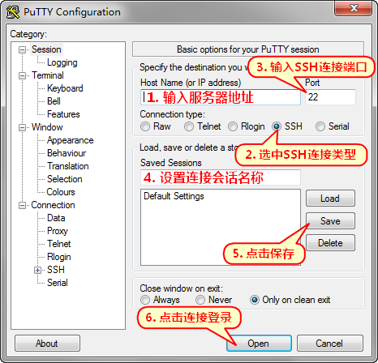

# 实验前准备

## 一、云服务购买

可以使用老师购买好的服务器。IP地址见下面文档。使用老师服务器的同学，可以路过“1.1 购买云服务器”和“1.2 配置服务器安全策略”。



本节主要介绍购买云服务器，并以腾讯云服务器为例详细介绍购买和配置流程。


同学们也可以在自己的主机上安装Ubuntu操作系统


### 1.1 购买云服务器

登录以下网址，购买腾讯云CVM


[https://cloud.tencent.com/product/cvm](https://cloud.tencent.com/product/cvm)


* 选择自定义配置、按量计费。
* 然后根据自己的需求选择CPU和内存的大小。本实验使用2核心CPU和4GB内存即可。
* 镜像选择 公共镜像、Ubuntu、64位最新版本
* 存储选择高性能云硬盘，容量40GB够用了。
* 点击一步，配置网络。网络带宽计费模式选择“按使用流量”
* 安全组可以选择“新建设安全组”
* 登录方式可以选择设置密码，然后输入你想要的密码，并记住密码。后续将使用登录名为ubuntu进行登录。

<figure><figcaption><p>购买云服务器CVM，选择配置</p></figcaption></figure>

#### 购买成功后

购买成功后，服务器将会自动启动，启动完成会分配两个IP地址，分别是公网和内网IP。公网IP地址即是可以访问的IP地址。如下图所示，可用公网IP：1.13.1.218，登录服务器。

<figure><figcaption></figcaption></figure>

### 1.2 配置服务器安全策略

进入腾讯云后台，进入实例列表。选择对应的服务器，点击更多->安全组->配置安全组。

再点击对应的安全组名称进入编辑界面。

点击添加规则，来源：0.0.0.0/0，协议端口：ALL，策略：允许

<figure><figcaption></figcaption></figure>

<figure><figcaption></figcaption></figure>


### 1.3 登录腾讯云服务器

> 如果 使用老师购买的服务器，按以下信息登录服务器：
>
> * 用户名：hadoop
> * 密码： Guet@1130182

本节使用Putty登录服务器，并对远程服务器进行管理和操作。

#### 下载安装Putty软件


Putty安装包


运行 putty.exe，在程序界面内输入服务器 IP 地址和端口（22 是 SSH 默认端口），选中 SSH 连接类型，设置连接会话名称及点击保存，然后点击 Open 按钮开始连接登录。

<figure><figcaption><p>Putty主界面</p></figcaption></figure>

首次连接会提示服务器指纹，选择是或否。“是”将保存指纹，“否”则不保存。保存后登录同一台服务器将不再提示（如果提示，则表示服务器指纹发生了变化，可能是重装系统所致或连接服务器被冒充）。

<figure><figcaption></figcaption></figure>

之后输入用户名（如果购买的云服务器，用户名为ubuntu）和密码即可登录服务器（输入密码时不会显示输入状态，这是一个安全设计。鼠标右键点击可以粘贴输入）。

<figure><figcaption></figcaption></figure>

## 二、服务器配置

### 2.1 创建hadoop用户

创建用户：

```
sudo useradd -m hadoop -s /bin/bash
```

设置密码，可简单设置为 hadoop，按提示输入两次密码：

```
sudo passwd hadoop
```

hadoop 用户增加管理员权限，方便部署：

```
sudo adduser hadoop sudo
```

用hadoop用户登录

```
su - hadoop                          #切换当前用户为用户hadoop
```

分别运行上面命令后，系统中创建一个用户名为hadoop的用户，该用户拥有管理员权限，并使用hadoop用户登录当前系统。

### 2.2 安装最新版本的Java

更新软件列表

```
sudo apt-get update
```

安装openjdk-8-jdk

```
sudo apt-get install openjdk-8-jdk
```

查看Java版本，如下：

```
java -version
```

安装好 OpenJDK 后，需要找到相应的安装路径

```
update-alternatives --config java 
```

我们输出的路径为

```
/usr/lib/jvm/java-8-openjdk-amd64/jre/bin/java
```

其中，绝对路径为

```
/usr/lib/jvm/java-8-openjdk-amd64
```

接着配置 _**JAVA\_HOME**_ 环境变量，为方便，我们在 \~/.bashrc 中进行设置

```
sudo vi /etc/profile
```

在文件最前面添加如下单独一行（注意 = 号前后不能有空格），将“JDK安装路径”改为绝对路径，并保存：

```
export JAVA_HOME=/usr/lib/jvm/java-8-openjdk-amd64
export JRE_HOME=$JAVA_HOME/jre
export PATH=$JAVA_HOME/bin:$PATH
export CLASSPATH=$JAVA_HOME/lib:$JRE_HOME/lib
export HADOOP_HOME=/usr/local/hadoop
export PATH=$PATH:$HADOOP_HOME/bin:$HADOOP_HOME/sbin
```

先Ctrl+C拷贝以上内容到粘贴板， 进入窗口，移动键盘上下键，将光标移动到合适位置，点键盘I，再Ctrl+V粘贴内容。 再将ESC后，输入以后内容后回车。

```
:wq
```

让该环境变量生效

```
source /etc/profile
```

设置好后我们来检验一下是否设置正确：

```
echo $JAVA_HOME     # 检验变量值
java -version
$JAVA_HOME/bin/java -version  # 与直接执行 java -version 一样
```

### 2.3 修改HOSTS

输入以下命令，进入hosts文件编辑界面。hosts文件存在于/etc/hosts

```
sudo vi /etc/hosts
```

删除以下内容

```
127.0.1.1 localhost.localdomain VM-0-2-ubuntu
```

增加以一上内容，这样就可以直接使用hadoop01来访问这台主机了。注意10.206.0.2为你主机的内网IP地址、

```
10.206.0.2 hadoop01
```

然后依次输入 Esc， :wq，回车

## 三、Hadoop配置

### 3.1 Hadoop单机部署

#### 3.1.1 下载

```
wget https://mirrors.bfsu.edu.cn/apache/hadoop/common/hadoop-3.4.1/hadoop-3.4.1.tar.gz
```

#### 3.1.2 解压

```
sudo tar -zxvf hadoop-3.4.1.tar.gz -C /usr/local/
cd /usr/local
sudo mv  hadoop-3.4.1    hadoop #重命名为hadoop
sudo chown -R hadoop ./hadoop                        #修改文件权限
```

#### 3.1.3 配置Hadoop环境

```
vi ~/.bashrc
```

给hadoop配置环境变量，将下面代码添加到.bashrc文件:

```
export HADOOP_HOME=/usr/local/hadoop
export CLASSPATH=$($HADOOP_HOME/bin/hadoop classpath):$CLASSPATH
export HADOOP_COMMON_LIB_NATIVE_DIR=$HADOOP_HOME/lib/native
export PATH=$PATH:$HADOOP_HOME/bin:$HADOOP_HOME/sbin
```

同样，执行source \~/.bashrc使设置生效，并查看hadoop是否安装成功

```
source ~/.bashrc
```

#### 3.1.4 修改配置文件

在 /usr/local/hadoop/etc/hadoop/hadoop-env.sh 文件中，增加以下内容。

```
vi /usr/local/hadoop/etc/hadoop/hadoop-env.sh 
```

```
export JAVA_HOME=/usr/lib/jvm/java-8-openjdk-amd64
```

> 如是使用Putty远程连接到服务器，可以使用vi直接修改，也可以用FileZilla软件将待修改的文件下载到本地修改后，再上传到服务器

#### 3.1.5 验证单机安装

进入 /usr/local/hadoop/ 目录，运行以下命令后，查看运行结果，并分析结果。

```
cd /usr/local/hadoop/
mkdir input
cp etc/hadoop/*.xml input
bin/hadoop jar share/hadoop/mapreduce/hadoop-mapreduce-examples-3.4.1.jar grep input output 'dfs[a-z.]+'
cat output/*
```

### 3.2 伪分布式

#### 3.2.1 修改配置文件

**修改 /usr/local/hadoop/etc/hadoop/hadoop-env.sh**

```
vi /usr/local/hadoop/etc/hadoop/hadoop-env.sh
```

hadoop-env.sh中，添加如下代码：

```
export JAVA_HOME=/usr/lib/jvm/java-8-openjdk-amd64
```

**修改 /usr/local/hadoop/etc/hadoop/hadoop-env.sh**

```
vi /usr/local/hadoop/etc/hadoop/yarn-env.sh
```

yarn-env.sh中，添加如下代码：

```
export JAVA_HOME=/usr/lib/jvm/java-8-openjdk-amd64
```

**修改 /usr/local/hadoop/etc/hadoop/core-site.xml**

```
vi /usr/local/hadoop/etc/hadoop/core-site.xml
```

在core-site.xml文件的中增加以下内容。

```
<configuration>
    <property>
            <name>fs.defaultFS</name>
            <value>hdfs://hadoop01:9000</value>
    </property>
    <property>
            <name>hadoop.tmp.dir</name>
            <value>/usr/local/hadoop/temp</value>
    </property>
</configuration>
```

**修改 /usr/local/hadoop/etc/hadoop/hdfs-site.xml**

```
vi /usr/local/hadoop/etc/hadoop/hdfs-site.xml
```

在hdfs-site.xml文件的中增加以下内容。

```
<configuration>
    <property>
            <name>dfs.namenode.secondary.http-address</name>
            <value>hadoop01:9001</value>
    </property>
    <property>
            <name>dfs.namenode.name.dir</name>
            <value>file://${hadoop.tmp.dir}/dfs/name</value>
    </property>
    <property>
            <name>dfs.datanode.data.dir</name>
            <value>file://${hadoop.tmp.dir}/dfs/data</value>
    </property>
    <property>
            <name>dfs.replication</name>
            <value>1</value>
    </property>
    <property>
            <name>dfs.webhdfs.enabled</name>
            <value>true</value>
    </property>
    <property>
            <name>dfs.permissions</name>
            <value>false</value>
    </property>
    <property>
            <name>dfs.web.ugi</name>
           	<value>supergroup</value>
    </property>
    <property>
        <name>dfs.datanode.use.datanode.hostname</name>
        <value>true</value>
    </property>
</configuration>
```

**修改 /usr/local/hadoop/etc/hadoop/mapred-site.xml**

```
vi /usr/local/hadoop/etc/hadoop/mapred-site.xml
```

在mapred-site.xml文件的中增加以下内容。

```
<configuration>
    <property>
            <name>mapreduce.framework.name</name>
            <value>yarn</value>
    </property>
    <property>
      <name>yarn.app.mapreduce.am.env</name>
      <value>HADOOP_MAPRED_HOME=${HADOOP_HOME}</value>
    </property>
    <property>
      <name>mapreduce.map.env</name>
      <value>HADOOP_MAPRED_HOME=${HADOOP_HOME}</value>
    </property>
    <property>
      <name>mapreduce.reduce.env</name>
      <value>HADOOP_MAPRED_HOME=${HADOOP_HOME}</value>
    </property>
</configuration>
```

**修改 /usr/local/hadoop/etc/hadoop/yarn-site.xml**

```
vi /usr/local/hadoop/etc/hadoop/yarn-site.xml
```

在yarn-site.xml文件的中增加以下内容。

```
<configuration>
    <property>
            <name>yarn.nodemanager.aux-services</name>
            <value>mapreduce_shuffle</value>
    </property>
    <property>
            <name>yarn.nodemanager.aux-services.mapreduce.shuffle.class</name>
            <value>org.apache.hadoop.mapred.ShuffleHandler</value>
    </property>
</configuration>
```

**修改 /usr/local/hadoop/etc/hadoop/workers.sh**

```
vi /usr/local/hadoop/etc/hadoop/workers
```

works中，保留以下内容

```
hadoop01
```

#### 3.2.2 设置无密码登录

```
ssh-keygen -t rsa -P '' -f ~/.ssh/id_rsa
cat ~/.ssh/id_rsa.pub >> ~/.ssh/authorized_keys
chmod 0600 ~/.ssh/authorized_keys
```

#### 3.2.3 启动hadoop

```
/usr/local/hadoop/bin/hdfs namenode -format #格式化HDFS
/usr/local/hadoop/sbin/start-all.sh #启动
```

访问http://ip:9870，看是否可以访问。

## 四、Python开发环境配置

### 4.1 安装Anaconda

#### 4.1.1 下载anaconda

输入以下命令

```
cd ~/
wget https://mirrors.bfsu.edu.cn/anaconda/archive/Anaconda3-2022.10-Linux-x86_64.sh
```

#### 4.1.2 安装

输入以下命令

```
bash Anaconda3-2022.10-Linux-x86_64.sh
```

<figure><figcaption></figcaption></figure>

回车后查看许可证，按 q 退出许可证，然后输入 yes 表示同意

<figure><figcaption></figcaption></figure>

确认安装的路径，一般直接回车安装在默认的 /home/hadoop/anaconda3

<figure><figcaption></figcaption></figure>

很快就安装完毕。输入 yes 来确认使用 conda init 来启动

<figure><figcaption></figcaption></figure>

### 4.2 启动环境变量

如果现在输入 conda，会显示找不到命令，如：conda: command not found。需要启动已经修改环境变量，输入以下命令（以后都不用再 source 了，因为启动 Ubuntu 会自动 source）

```
source ~/.bashrc
```

这时候会发现出现了 (base)

### 4.3 创建虚拟环境

输入以下命令创建名为 hadoop 的虚拟环境，python 版本为 3.9

```
conda create -n hadoop python=3.9
```

安装时，输入y或yes，回车后将自动安装

### 4.4 进入虚拟环境

输入以下命令进入我们创建的虚拟环境 hadoop

```
conda activate hadoop
```

可以看到前缀已经从 base 变成了 hadoop，你输入 python 后可以看到，python 版本为 3.9.7

<figure><figcaption></figcaption></figure>

### 4.5 修改Anaconda 镜像

使用清华大学的镜像来提升下载速度

输入如下命令编辑镜像地址

```
vi ~/.condarc
```

在新文件中添加以下内容

```
channels:
  - defaults
show_channel_urls: true
default_channels:
  - https://mirrors.tuna.tsinghua.edu.cn/anaconda/pkgs/main
  - https://mirrors.tuna.tsinghua.edu.cn/anaconda/pkgs/r
  - https://mirrors.tuna.tsinghua.edu.cn/anaconda/pkgs/msys2
custom_channels:
  conda-forge: https://mirrors.tuna.tsinghua.edu.cn/anaconda/cloud
  msys2: https://mirrors.tuna.tsinghua.edu.cn/anaconda/cloud
  bioconda: https://mirrors.tuna.tsinghua.edu.cn/anaconda/cloud
  menpo: https://mirrors.tuna.tsinghua.edu.cn/anaconda/cloud
  pytorch: https://mirrors.tuna.tsinghua.edu.cn/anaconda/cloud
  pytorch-lts: https://mirrors.tuna.tsinghua.edu.cn/anaconda/cloud
  simpleitk: https://mirrors.tuna.tsinghua.edu.cn/anaconda/cloud
```

添加后，在命令窗口运行

```
conda clean -i
```

### 4.6 添加 python 模块

#### 4.6.1 添加HDFS访问模块

我们使用PyArrow来访问HDFS文件。

用于Apache Arrow的Python库。这个库为Arrow c++库提供的功能提供了Python API，以及用于与panda、NumPy和Python生态系统中的其他软件进行箭头集成和互操作性的工具。Apache Arrow是一个用于内存分析的开发平台。它包含一组技术，使大数据系统能够快速处理和移动数据。&#x20;

输入以下命令安装

```
conda activate hadoop
conda install -c conda-forge pyarrow
```

#### 4.6.2 添加MapReduce模块mrjob

mrjob是用来写能在hadoop运行的python程序的最简便方法。其最突出的特点就是在mrjob的帮助下，无需安装hadoop或部署任何集群，我们可以在本地机器上运行代码（进行测试）。同时，mrjob可以轻松运行于Amazon Elastic MapReduce。 为了达到简便实用的目的，一些功能被mrjob省去了。如果追求更多的功能，可以尝试Dumbo，Pydoop等package。

输入以下命令安装

```
conda activate hadoop
conda install -c conda-forge mrjob
```
