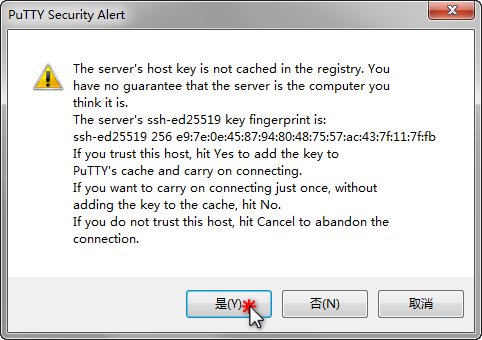

# 实验前准备

## 一、云服务购买

本节主要介绍购买云服务器，并以腾讯云服务器为例详细介绍购买和配置流程。


同学们也可以在自己的主机上安装Ubuntu操作系统


### 1.1 购买云服务器

登录以下网址，购买腾讯云CVM


[https://cloud.tencent.com/product/cvm](https://cloud.tencent.com/product/cvm)


* 选择自定义配置、按量计费。
* 然后根据自己的需求选择CPU和内存的大小。本实验使用2核心CPU和4GB内存即可。
* 镜像选择 公共镜像、Ubuntu、64位最新版本
* 存储选择高性能云硬盘，容量40GB够用了。
* 点击一步，配置网络。网络带宽计费模式选择“按使用流量”
* 安全组可以选择“新建设安全组”
* 登录方式可以选择设置密码，然后输入你想要的密码，并记住密码。后续将使用登录名为ubuntu进行登录。

<figure><figcaption>
购买云服务器CVM，选择配置
</figcaption></figure>

#### 购买成功后

购买成功后，服务器将会自动启动，启动完成会分配两个IP地址，分别是公网和内网IP。公网IP地址即是可以访问的IP地址。如下图所示，可用公网IP：1.13.1.218，登录服务器。

<figure><figcaption></figcaption></figure>

### 1.2 登录腾讯云服务器

本节使用Putty登录服务器，并对远程服务器进行管理和操作。

#### 下载安装Putty软件


Putty安装包


运行 putty.exe，在程序界面内输入服务器 IP 地址和端口（22 是 SSH 默认端口），选中 SSH 连接类型，设置连接会话名称及点击保存，然后点击 Open 按钮开始连接登录。

<figure><figcaption>
Putty主界面
</figcaption></figure>

首次连接会提示服务器指纹，选择是或否。“是”将保存指纹，“否”则不保存。保存后登录同一台服务器将不再提示（如果提示，则表示服务器指纹发生了变化，可能是重装系统所致或连接服务器被冒充）。

<figure><figcaption></figcaption></figure>

之后输入用户名（如果购买的云服务器，用户名为ubuntu）和密码即可登录服务器（输入密码时不会显示输入状态，这是一个安全设计。鼠标右键点击可以粘贴输入）。

<figure><figcaption></figcaption></figure>

### 1.3 配置服务器

#### 1.3.1 创建hadoop用户

创建用户：

    sudo useradd -m hadoop -s /bin/bash

设置密码，可简单设置为 hadoop，按提示输入两次密码：

    sudo passwd hadoop

hadoop 用户增加管理员权限，方便部署：

    sudo adduser hadoop sudo

用hadoop用户登录

    su - hadoop                          #切换当前用户为用户hadoop

分别运行上面命令后，系统中创建一个用户名为hadoop的用户，该用户拥有管理员权限，并使用hadoop用户登录当前系统。

#### 1.3.2 安装最新版本的Java

更新软件列表

    sudo apt-get update

安装openjdk-8-jdk

    sudo apt-get install openjdk-8-jdk

查看Java版本，如下：

    java -version

安装好 OpenJDK 后，需要找到相应的安装路径

    update-alternatives --config java 

我们输出的路径为

    /usr/lib/jvm/java-8-openjdk-amd64/jre/bin/java

其中，绝对路径为

    /usr/lib/jvm/java-8-openjdk-amd64

接着配置 ***JAVA\_HOME*** 环境变量，为方便，我们在 \~/.bashrc 中进行设置

    sudo vi /etc/profile

在文件最前面添加如下单独一行（注意 = 号前后不能有空格），将“JDK安装路径”改为绝对路径，并保存：

    export JAVA_HOME=/usr/lib/jvm/java-8-openjdk-amd64
    export JRE_HOME=$JAVA_HOME/jre
    export PATH=$JAVA_HOME/bin:$PATH
    export CLASSPATH=$JAVA_HOME/lib:$JRE_HOME/lib
    export HADOOP_HOME=/usr/local/hadoop
    export PATH=$PATH:$HADOOP_HOME/bin:$HADOOP_HOME/sbin

先Ctrl+C拷贝以上内容到粘贴板，
进入窗口，移动键盘上下键，将光标移动到合适位置，点键盘I，再Ctrl+V粘贴内容。
再将ESC后，输入以后内容后回车。

    :wq

让该环境变量生效

    source /etc/profile

设置好后我们来检验一下是否设置正确：

    echo $JAVA_HOME     # 检验变量值
    java -version
    $JAVA_HOME/bin/java -version  # 与直接执行 java -version 一样

### 1.4 Hadoop单机部署

#### 下载

    wget https://mirrors.bfsu.edu.cn/apache/hadoop/common/hadoop-3.3.4/hadoop-3.3.4.tar.gz

#### 解压

    sudo tar -zxvf hadoop-3.3.4.tar.gz -C /usr/local/
    cd /usr/local
    sudo mv  hadoop-3.3.4    hadoop #重命名为hadoop
    sudo chown -R hadoop ./hadoop                        #修改文件权限

#### 配置Hadoop环境

    vi ~/.bashrc

给hadoop配置环境变量，将下面代码添加到.bashrc文件:

    export HADOOP_HOME=/usr/local/hadoop
    export CLASSPATH=$($HADOOP_HOME/bin/hadoop classpath):$CLASSPATH
    export HADOOP_COMMON_LIB_NATIVE_DIR=$HADOOP_HOME/lib/native
    export PATH=$PATH:$HADOOP_HOME/bin:$HADOOP_HOME/sbin

同样，执行source \~/.bashrc使设置生效，并查看hadoop是否安装成功

    source ~/.bashrc

#### 修改配置文件

在 /usr/local/hadoop/etc/hadoop/hadoop-env.sh 文件中，增加以下内容。

    vi /usr/local/hadoop/etc/hadoop/hadoop-env.sh 

<!---->

    # set to the root of your Java installation
    export JAVA_HOME=/usr/lib/jvm/java-8-openjdk-amd64

> 如是使用Putty远程连接到服务器，可以使用vi直接修改，也可以用FileZilla软件将待修改的文件下载到本地修改后，再上传到服务器

#### 验证单机安装

进入 /usr/local/hadoop/ 目录，运行以下命令后，查看运行结果，并分析结果。

    cd /usr/local/hadoop/
    mkdir input
    cp etc/hadoop/*.xml input
    bin/hadoop jar share/hadoop/mapreduce/hadoop-mapreduce-examples-3.3.1.jar grep input output 'dfs[a-z.]+'
    cat output/*
