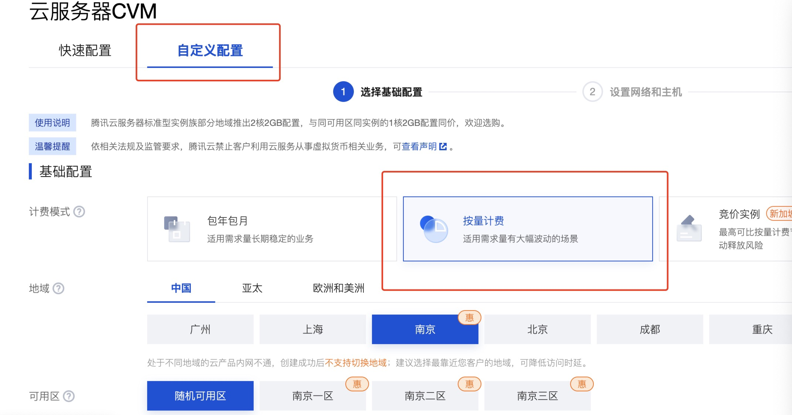
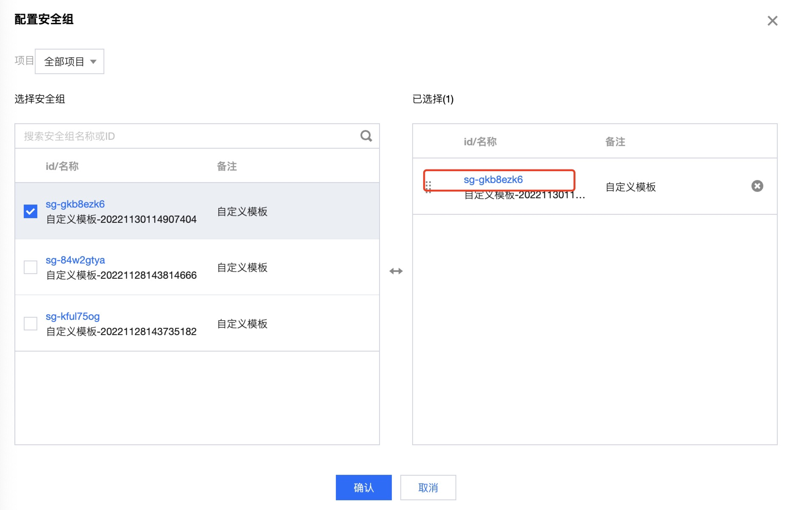

# 实验前准备

## 一、云服务购买

可以使用老师购买好的服务器。IP地址见下面文档。使用老师服务器的同学，可以路过“1.1 购买云服务器”和“1.2 配置服务器安全策略”。



本节主要介绍购买云服务器，并以腾讯云服务器为例详细介绍购买和配置流程。


同学们也可以在自己的主机上安装Ubuntu操作系统


### 1.1 购买云服务器

登录以下网址，购买腾讯云CVM


[https://cloud.tencent.com/product/cvm](https://cloud.tencent.com/product/cvm)


* 选择自定义配置、按量计费。
* 然后根据自己的需求选择CPU和内存的大小。本实验使用2核心CPU和4GB内存即可。
* 镜像选择 公共镜像、Ubuntu、64位最新版本
* 存储选择高性能云硬盘，容量40GB够用了。
* 点击一步，配置网络。网络带宽计费模式选择“按使用流量”
* 安全组可以选择“新建设安全组”
* 登录方式可以选择设置密码，然后输入你想要的密码，并记住密码。后续将使用登录名为ubuntu进行登录。

<figure><figcaption>
购买云服务器CVM，选择配置
</figcaption></figure>

#### 购买成功后

购买成功后，服务器将会自动启动，启动完成会分配两个IP地址，分别是公网和内网IP。公网IP地址即是可以访问的IP地址。如下图所示，可用公网IP：1.13.1.218，登录服务器。

<figure><figcaption></figcaption></figure>

### 1.2 配置服务器安全策略

进入腾讯云后台，进入实例列表。选择对应的服务器，点击更多->安全组->配置安全组。

再点击对应的安全组名称进入编辑界面。

点击添加规则，来源：0.0.0.0/0，协议端口：ALL，策略：允许

<figure><figcaption></figcaption></figure>

<figure><figcaption></figcaption></figure>

### 1.3 登录腾讯云服务器

> 如果 使用老师购买的服务器，按以下信息登录服务器：
>
> * 用户名：hadoop
> * 密码： Guet@1130182

本节使用Putty登录服务器，并对远程服务器进行管理和操作。

#### 下载安装Putty软件

运行 putty.exe，在程序界面内输入服务器 IP 地址和端口（22 是 SSH 默认端口），选中 SSH 连接类型，设置连接会话名称及点击保存，然后点击 Open 按钮开始连接登录。

<figure><figcaption>
Putty主界面
</figcaption></figure>

首次连接会提示服务器指纹，选择是或否。“是”将保存指纹，“否”则不保存。保存后登录同一台服务器将不再提示（如果提示，则表示服务器指纹发生了变化，可能是重装系统所致或连接服务器被冒充）。

<figure><figcaption></figcaption></figure>

之后输入用户名（如果购买的云服务器，用户名为ubuntu）和密码即可登录服务器（输入密码时不会显示输入状态，这是一个安全设计。鼠标右键点击可以粘贴输入）。

<figure><figcaption></figcaption></figure>
