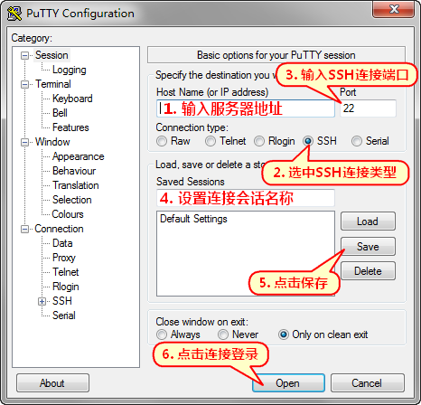
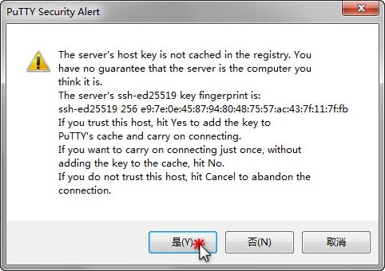
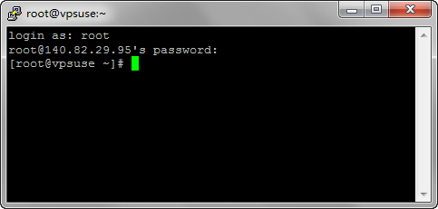
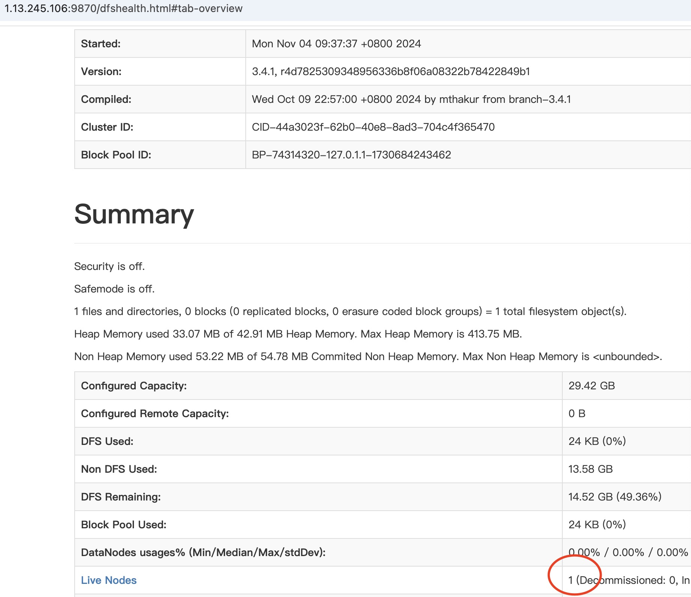
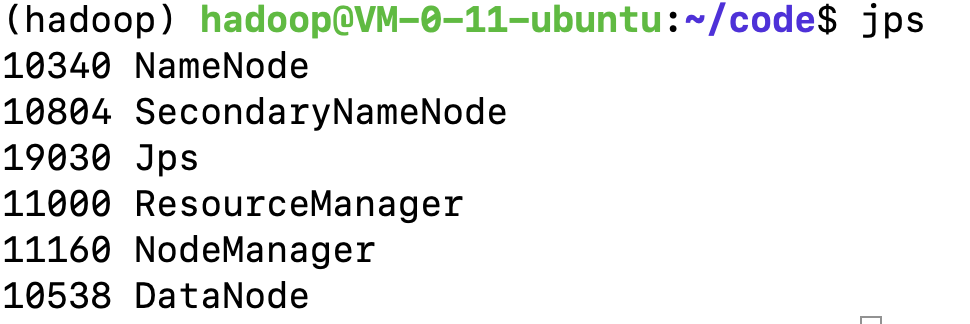

# 使用老师分配的腾讯云服务器

## 1. 查找自己的IP地址

IP地址见下面文档。



.png>)

如上图所示，王立博同学的服务器公网IP地址是118.195.248.243，内网IP地址是10.206.0.98。记住这两个IP地址。

## 2. 使用Putty软件连接服务器

使用Putty登录服务器，并对远程服务器进行管理和操作。

#### 下载安装Putty软件


Putty安装包


运行 putty.exe，在程序界面内输入服务器 IP 地址和端口（22 是 SSH 默认端口），选中 SSH 连接类型，设置连接会话名称及点击保存，然后点击 Open 按钮开始连接登录。

<figure><figcaption><p>Putty主界面</p></figcaption></figure>

首次连接会提示服务器指纹，选择是或否。“是”将保存指纹，“否”则不保存。保存后登录同一台服务器将不再提示（如果提示，则表示服务器指纹发生了变化，可能是重装系统所致或连接服务器被冒充）。

<figure><figcaption></figcaption></figure>

之后输入用户名（如果购买的云服务器，用户名为hadoop）和密码是Guet@1130182 即可登录服务器（输入密码时不会显示输入状态，这是一个安全设计。鼠标右键点击可以粘贴输入）。

> 如果 使用老师购买的服务器，按以下信息登录服务器：
>
> * 用户名：hadoop
> * 密码： Guet@1130182

<figure><figcaption></figcaption></figure>

## 3. 初始化服务器

输入以下命令&#x20;

```
./start.sh
```

执行时，会提示输入密码。密码是hadoop用户的密码 Guet@1130182

执行完成后，在浏览器中输入  http://ip:9870检查Hadoop是否启动成功。如下图所示，如果Live nodes为1，表示启动成功。

<figure><figcaption></figcaption></figure>


## 4. 检查Hadoop是否启动成功

输入以下命令启动

```
jps
```

输入jps命令，查询Hadoop是否启动成功，如果启动成果，输入jps后，会显示如下内容。



使用浏览器验证Hadoop是否启动成功，在浏览器中访问http://ip:9870，ip改为你的公网IP地址。

.png>)

## 5. 如遇Hadoop启动出错

如果在执法hadoop启动后，输入jps后显示的进行和老师的不一致，或无法通过网址访问，按以下方式操作

```
/usr/local/hadoop/sbin/stop-all.sh #停止Hadoop
rm -r /usr/local/hadoop/logs #删除log
rm -r /usr/local/hadoop/temp #删除临时文件
/usr/local/hadoop/bin/hdfs namenode -format #格式化HDFS
/usr/local/hadoop/sbin/start-all.sh #启动
```
